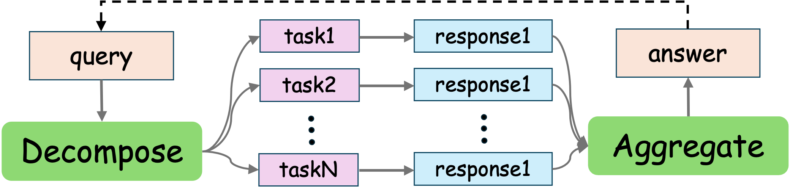

  <h1 align="center">Awesome-Parallel-Reasoning</h1>

  <a href=https://github.com/PPPP-kaqiu/Awesome-Parallel-Reasoning/blob/main/A-Survey-on-Parallel-Reasoning.pdf>A-Survey-on-Parallel-Reasoning</a>

  <strong>Curated collection of papers and resources on unlocking the potential of test time scaling of reasoning in large language models</strong>

# Overview

In recent years, the capabilities of Large Language Models (LLMs) have advanced at an unprecedented rate. This progress has been largely attributed to the scaling of model parameters, training data, and computational resources. At the same time, inference-time performance has been significantly improved by extending the computational "length" through methods like Chain-of-Thought, which enables models to formulate a reasoning process before delivering a final answer.

This raises a compelling question: beyond scaling the "depth" (model layers) and "length" (sequential reasoning), can we unlock new potential by introducing a "width" dimension to test-time computation? This collection explores this emerging frontier of **parallel reasoning**, which focuses on broadening the computational scope at inference time. Instead of pursuing a single line of thought, this paradigm involves generating and evaluating multiple, diverse reasoning paths or hypotheses in parallel. Conceptual examples can be seen in approaches where a model considers several hypotheses at once before proceeding, or in advanced multi-agent systems, like those explored by Gemini&Anthropic, where a lead agent coordinates multiple parallel agents to accomplish a goal.

The adoption of parallel reasoning offers a dual advantage. First, it significantly expands the effective computational budget for any given query, enhancing the robustness and quality of the final output. Second, it holds immense practical value by drastically reducing latency, a critical factor for improving user experience in real-world applications.

To systematically survey this exciting area, this collection curates key papers and resources, organized into the following categories:

1.  [**Non-interactive Methods**](#non-interactive-methods): Methods where multiple reasoning paths are generated independently without overt communication, followed by a final aggregation step to produce a single answer.
    * [**Self-Consistency**](#self-consistency):The foundational approach where a model generates multiple responses, and the final answer is selected based on consensus, typically through majority voting or by weighting votes using the model's internal confidence scores.
    * [**Ranking base**](#ranking-base): This paradigm employs an external verifier or reward model to either rank and select the best candidate solution or synthesize a new, superior one by integrating insights from multiple reasoning paths.
        * [**Best-of-N Sampling**](#best-of-n-Sampling): A method based on the principle that generating N solutions increases the probability of finding a correct one, which is then identified and selected by a verifier model.
        * [**Advancing Verifier**](#advancing-verifier): Research focused on improving the ranking component itself, evolving from models that score the final outcome (ORMs) to those that score each reasoning step (PRMs).
        * [**Ranking Mechanism**](#ranking-mechanism): Advanced techniques that shift from absolute scoring to relative judgments, using methods like pairwise comparisons or multi-stage filtering to efficiently identify the best candidate.
        * [**Generative Synthesis**](#generative-synthesis): A paradigm that moves beyond selection to construct a new, superior solution by integrating insights from all generated candidates, often using an "explorer-synthesizer" architecture.
    * [**Structure reasoning**](#structure-reasoning): A shift from linear Chain-of-Thought to dynamic problem-solving topologies that allow for exploring and integrating multiple lines of thought.
        * [**Foundational Structures**](#foundational-structures): Seminal frameworks that introduced non-linear reasoning paths, such as Tree-of-Thoughts (ToT) and Graph-of-Thoughts (GoT).
        * [**Guided Search & Efficiency Optimization**](#guided-search-&-efficiency-optimization): Techniques designed to manage the vast search spaces of structured reasoning, using guided search strategies and system-level enhancements to improve efficiency.
        * [**Other Paradigm**](#other-paradigm): Frameworks that redefine the LLM's role from a monolithic reasoner to a specialized component within a larger cognitive architecture.
2.  [**Interactive Methods**](#interactive-methods):A paradigm where multiple reasoning paths or agents dynamically exchange information during the inference process, rather than only at the end.
    * [**Intra-interaction**](#intra-interaction): Interaction where different reasoning threads within a single model share information to adjust their trajectories during generation.
    * [**Inter-interaction**](#inter-interaction): Interaction where multiple autonomous models or agents collaborate by exchanging intermediate results or engaging in dialogue.
        * [**Debate Reflection**](#debate-reflection): A method where multiple agents engage in structured dialogue, critiquing and defending arguments to reach a more robust consensus.
        * [**Collaboration Division of Labor**](#collaboration-division-of-labor): Approaches that distribute reasoning workloads across specialized agents, either by decomposing tasks or assigning distinct roles.
        * [**Mixture of Agents**](#mixture-of-agents): Methods that harness the complementary expertise of multiple agents through structured frameworks, like layered architectures where agents build upon the outputs of others.
3.  [**Efficiency Methods**](#efficiency-methods): Techniques that focus on accelerating the autoregressive decoding process itself by parallelizing token generation.
    * [**Parallel Decoding**](#parallel-decoding): Exploits task-level or semantic-level parallelism by decomposing a generation task into independent units that can be decoded concurrently.
    * [**Parallel Function Calling**](#parallel-function-calling): Introduces parallelism at the system level by enabling an LLM to schedule and execute multiple external tool calls simultaneously.
    * [**Speculative Decoding**](#speculative-decoding): Accelerates token-level generation using a "draft-and-verify" paradigm, where a faster model proposes candidate tokens that the main model verifies in parallel.
4.  [**Available Source**](#available-source): A review of prominent industry models and systems that leverage parallel reasoning to achieve state-of-the-art performance in complex domains.
5.  [**Discussion🔥🔥🔥**](#discussion): Discussion into the core principles of parallel reasoning, welcome to communicate in issue or email!

# 📄 Papers
## Non-interactive Methods
### Self-Consistency
[2203] [Self-Consistency Improves Chain of Thought Reasoning in Language Models](https://arxiv.org/pdf/2203.11171)  [Code 💻]()  
Xuezhi Wang, Jason Wei, Dale Schuurmans, Quoc Le, Ed H. Chi, Sharan Narang, Aakanksha Chowdhery, Denny Zhou

[2305] [Let’s Sample Step by Step: Adaptive-Consistency for Efficient Reasoning and Coding with LLMs](https://arxiv.org/pdf/2305.11860)  [Code 💻](https://github.com/Pranjal2041/AdaptiveConsistency)  
Pranjal Aggarwal, Aman Madaan, Yiming Yang, Mausam

[2311] [Universal Self-Consistency for Large Language Model Generation](https://arxiv.org/abs/2311.17311) 
Xinyun Chen, Renat Aksitov, Uri Alon, Jie Ren, Kefan Xiao, Pengcheng Yin, Sushant Prakash, Charles Sutton, Xuezhi Wang, Denny Zhou

[2402] [Soft Self-Consistency Improves Language Model Agents](https://arxiv.org/pdf/2402.13212)  [Code 💻](https://github.com/HanNight/soft_self_consistency)  
Han Wang, Archiki Prasad, Elias Stengel-Eskin, Mohit Bansal

[2508] [Deep Think with Confidence](https://arxiv.org/abs/2508.15260)  [Code 💻](https://github.com/facebookresearch/deepconf)  
Yichao Fu, Xuewei Wang, Yuandong Tian, Jiawei Zhao

[2508] [Confidence-Weighted Token Set Cover for Early Hypothesis Pruning in Self-Consistency](https://arxiv.org/abs/2508.03979)
Md Arafat Sultan, Ramón Fernandez Astudillo

### Ranking base
#### Best-of-N Sampling
[2408] [Scaling LLM Test-Time Compute Optimally can be More Effective than Scaling Model Parameters](https://arxiv.org/abs/2408.03314)
Charlie Snell, Jaehoon Lee, Kelvin Xu, Aviral Kumar

[2407] [Large Language Monkeys: Scaling Inference Compute with Repeated Sampling](https://arxiv.org/abs/2407.21787)  [Code 💻](https://github.com/ScalingIntelligence/large_language_monkeys)   
Bradley Brown, Jordan Juravsky, Ryan Ehrlich, Ronald Clark, Quoc V. Le, Christopher Ré, Azalia Mirhoseini
#### Advancing Verifier
[2110] [Training Verifiers to Solve Math Word Problems](https://arxiv.org/pdf/2110.14168)  
Karl Cobbe, Vineet Kosaraju, Mohammad Bavarian, Mark Chen, Heewoo Jun, Lukasz Kaiser, Matthias Plappert, Jerry Tworek, Jacob Hilton, Reiichiro Nakano, Christopher Hesse, John Schulman

[2211] [Solving math word problems with process- and outcome-based feedback](https://arxiv.org/abs/2211.14275)  
Jonathan Uesato, Nate Kushman, Ramana Kumar, Francis Song, Noah Siegel, Lisa Wang, Antonia Creswell, Geoffrey Irving, Irina Higgins

[2312] [Math-Shepherd: Verify and Reinforce LLMs Step-by-step without Human Annotations](https://arxiv.org/abs/2312.08935) 
Peiyi Wang, Lei Li, Zhihong Shao, R.X. Xu, Damai Dai, Yifei Li, Deli Chen, Y.Wu, Zhifang Sui

[2408] [Generative Verifiers: Reward Modeling as Next-Token Prediction](https://arxiv.org/pdf/2408.15240)  [Code 💻](https://sites.google.com/view/generative-reward-models)  
Lunjun Zhang, Arian Hosseini, Hritik Bansal, Mehran Kazemi, Aviral Kumar, Rishabh Agarwal

[2509] [Latency and Token-Aware Test-Time Compute](https://arxiv.org/abs/2509.09864)
Jenny Y. Huang, Mehul Damani, Yousef El-Kurdi, Ramon Astudillo, Wei Sun

[2510] [Parallel Test-Time Scaling for Latent Reasoning Models](https://arxiv.org/abs/2510.07745)  [Code 💻](https://github.com/YRYangang/LatentTTS)  
Runyang You, Yongqi Li, Meng Liu, Wenjie Wang, Liqiang Nie, Wenjie Li
#### Ranking Mechanism
[2406] [BoNBoN Alignment for Large Language Models and the Sweetness of Best-of-n Sampling](https://arxiv.org/abs/2406.00832)  [Code 💻](https://github.com/gl-ybnbxb/BoNBoN)  
Lin Gui, Cristina Gârbacea, Victor Veitch

[2501] [PairJudge RM: Perform Best-of-N Sampling with Knockout Tournament](https://arxiv.org/abs/2501.13007)  [Code 💻](https://github.com/THU-KEG/PairJudgeRM/)  
Yantao Liu, Zijun Yao, Rui Min, Yixin Cao, Lei Hou, Juanzi Li

#### Generative Synthesis
[2506] [Learning to Reason Across Parallel Samples for LLM Reasoning](https://arxiv.org/pdf/2506.09014) 
Jianing Qi, Xi Ye, Hao Tang, Zhigang Zhu, Eunsol Choi

[2507] [Adaptive Termination for Multi-round Parallel Reasoning: An Universal Semantic Entropy-Guided Framework](https://arxiv.org/abs/2507.06829)  
Zenan Xu, Zexuan Qiu, Guanhua Huang, Kun Li, Siheng Li, Chenchen Zhang, Kejiao Li, Qi Yi, Yuhao Jiang, Bo Zhou, Fengzong Lian, Zhanhui Kang

[2509] [Learning to Refine: Self-Refinement of Parallel Reasoning in LLMs](https://arxiv.org/pdf/2509.00084)
Qibin Wang, Pu Zhao, Shaohan Huang, Fangkai Yang, Lu Wang, Furu Wei, Qingwei Lin, Saravan Rajmohan, Dongmei Zhang

[2509] ⭐⭐⭐ [A2R: An Asymmetric Two-Stage Reasoning Framework for Parallel Reasoning](https://arxiv.org/abs/2509.22044) [Code 💻](https://github.com/PPPP-kaqiu/A2R)  
Ziqi Wang, Boye Niu, Zhongli Li, Linghui Meng, Jing Liu, Zhi Zheng, Tong Xu, Hua Wu, Haifeng Wang, Enhong Chen

[2509] [Recursive Self-Aggregation Unlocks Deep Thinking in Large Language Models](http://arxiv.org/abs/2509.26626) [Code 💻](https://github.com/HyperPotatoNeo/RSA)  
Siddarth Venkatraman, Vineet Jain, Sarthak Mittal, Vedant Shah, Johan Obando-Ceron, Yoshua Bengio, Brian R. Bartoldson, Bhavya Kailkhura, Guillaume Lajoie, Glen Berseth, Nikolay Malkin, Moksh Jain

[2510] [Rethinking Thinking Tokens: LLMs as Improvement Operators](https://arxiv.org/abs/2510.01123)
Lovish Madaan, Aniket Didolkar, Suchin Gururangan, John Quan, Ruan Silva, Ruslan Salakhutdinov, Manzil Zaheer, Sanjeev Arora, Anirudh Goyal

### Structure reasoning
#### Foundational Structures
[2305] [Tree of Thoughts: Deliberate Problem Solving with Large Language Models](https://arxiv.org/abs/2305.10601)  [Code 💻](https://github.com/kyegomez/tree-of-thoughts)  
Shunyu Yao, Dian Yu, Jeffrey Zhao, Izhak Shafran, Thomas L. Griffiths, Yuan Cao, Karthik Narasimhan

[2308] [Graph of Thoughts: Solving Elaborate Problems with Large Language Models](https://arxiv.org/pdf/2203.11171)  [Code 💻](https://github.com/spcl/graph-of-thoughts)  
Maciej Besta1*, Nils Blach1*, Ales Kubicek, Robert Gerstenberger, Michał Podstawski, Lukas Gianinazzi, Joanna Gajda, Tomasz Lehmann, Hubert Niewiadomski, Piotr Nyczyk, Torsten Hoefler

[2308] [Cumulative Reasoning with Large Language Models](https://arxiv.org/abs/2308.04371)  [Code 💻](https://github.com/iiis-ai/cumulative-reasoning)  
Yifan Zhang, Jingqin Yang, Yang Yuan, Andrew Chi-Chih Yao

[2509] [Flash-Searcher: Fast and Effective Web Agents via DAG-Based Parallel Execution](https://arxiv.org/abs/2509.25301)  [Code 💻](https://github.com/OPPO-PersonalAI/Flash-Searcher)  
Tianrui Qin, Qianben Chen, Sinuo Wang, He Xing, King Zhu, He Zhu, Dingfeng Shi, Xinxin Liu, Ge Zhang, Jiaheng Liu, Yuchen Eleanor Jiang, Xitong Gao, Wangchunshu Zhou

[2510] [Thoughtbubbles: an Unsupervised Method for Parallel Thinking in Latent Space](https://arxiv.org/abs/2510.00219) 
Houjun Liu, Shikhar Murty, Christopher D. Manning, Róbert Csordás
#### Guided Search & Efficiency Optimization
[2305] [Self-Evaluation Guided Beam Search for Reasoning](https://arxiv.org/abs/2305.00633)  [Code 💻](https://github.com/YuxiXie/SelfEval-Guided-Decoding)  
Yuxi Xie, Kenji Kawaguchi, Yiran Zhao, Xu Zhao, Min-Yen Kan, Junxian He, Qizhe Xie

[2307] [Skeleton-of-Thought: Prompting LLMs for Efficient Parallel Generation](https://arxiv.org/abs/2307.15337)  [Code 💻](https://github.com/imagination-research/sot)  
Xuefei Ning, Zinan Lin, Zixuan Zhou, Zifu Wang, Huazhong Yang, Yu Wang

[2501] [Enhancing Reasoning through Process Supervision with Monte Carlo Tree Search](https://arxiv.org/abs/2501.01478)
Shuangtao Li, Shuaihao Dong, Kexin Luan, Xinhan Di, Chaofan Ding

[2502] [Dynamic Parallel Tree Search for Efficient LLM Reasoning](https://arxiv.org/abs/2502.16235)
Yifu Ding, Wentao Jiang, Shunyu Liu, Yongcheng Jing, Jinyang Guo, Yingjie Wang, Jing Zhang, Zengmao Wang, Ziwei Liu, Bo Du, Xianglong Liu, Dacheng Tao

[2502] [Atom of Thoughts for Markov LLM Test-Time Scaling](https://arxiv.org/abs/2502.12018)  [Code 💻](https://github.com/qixucen/atom)  
Fengwei Teng, Zhaoyang Yu, Quan Shi, Jiayi Zhang, Chenglin Wu, Yuyu Luo

#### Other Paradigm
[2210] [Measuring and Narrowing the Compositionality Gap in Language Models](https://arxiv.org/abs/2210.03350)  [Code 💻](https://github.com/ofirpress/self-ask)  
Ofir Press, Muru Zhang, Sewon Min, Ludwig Schmidt, Noah A. Smith, Mike Lewis

[2210] [ThinkSum: Probabilistic reasoning over sets using large language models](https://arxiv.org/abs/2210.01293)
Batu Ozturkler, Nikolay Malkin, Zhen Wang, Nebojsa Jojic

[2305] [Reasoning with Language Model is Planning with World Model](https://arxiv.org/abs/2305.14992)  [Code 💻](https://github.com/Ber666/llm-reasoners)
Shibo Hao, Yi Gu, Haodi Ma, Joshua Jiahua Hong, Zhen Wang, Daisy Zhe Wang, Zhiting Hu

---

## Interactive Methods
### Intra-interaction
[2502] [Speculate, then Collaborate: Fusing Knowledge of Language Models during Decoding](https://arxiv.org/abs/2502.08020)
Ziyao Wang, Muneeza Azmat, Ang Li, Raya Horesh, Mikhail Yurochkin

[2504] [Hogwild! Inference: Parallel LLM Generation via Concurrent Attention](https://arxiv.org/pdf/2504.06261)  [Code 💻](https://github.com/eqimp/hogwild_llm)  
Gleb Rodionov, Roman Garipov, Alina Shutova, George Yakushev, Erik Schultheis, Vage Egiazarian, Anton Sinitsin, Denis Kuznedelev, Dan Alistarh

[2504] [Learning Adaptive Parallel Reasoning with Language Models](https://arxiv.org/pdf/2504.15466)  [Code 💻](https://github.com/Parallel-Reasoning/APR)  
Jiayi Pan, Xiuyu Li, Long Lian, Charlie Snell, Yifei Zhou, Adam Yala, Trevor Darrell, Kurt Keutzer, Alane Suhr

[2505] [Learning from Peers in Reasoning Models](https://arxiv.org/pdf/2505.07787)  [Code 💻](https://github.com/tongxuluo/LeaP)  
Tongxu Luo, Wenyu Du, Jiaxi Bi, Stephen Chung, Zhengyang Tang, Hao Yang, Min Zhang, Benyou Wang

[2505] [Group Think: Multiple Concurrent Reasoning Agents Collaborating at Token Level Granularity](https://arxiv.org/abs/2505.11107)  
Chan-Jan Hsu, Davide Buffelli, Jamie McGowan, Feng-Ting Liao, Yi-Chang Chen, Sattar Vakili, Da-shan Shiu

[2506] [How we built our multi-agent research system](https://www.anthropic.com/engineering/built-multi-agent-research-system)  
Anthropic Team

[2508] [Hybrid Deep Searcher: Integrating Parallel and Sequential Search Reasoning](https://arxiv.org/pdf/2508.19113)
Dayoon Ko, Jihyuk Kim, Haeju Park, Sohyeon Kim, Dahyun Lee, Yongrae Jo, Gunhee Kim, Moontae Lee, Kyungjae Lee

[2508] [MIRAGE: Scaling Test-Time Inference with Parallel Graph-Retrieval-Augmented Reasoning Chains](https://arxiv.org/abs/2508.18260)
Kaiwen Wei, Rui Shan, Dongsheng Zou, Jianzhong Yang, Bi Zhao, Junnan Zhu, Jiang Zhong

[2509] [Parallel-R1: Towards Parallel Thinking via Reinforcement Learning](https://arxiv.org/abs/2509.07980)  [Code 💻](https://github.com/zhengkid/Parallel-R1)  
Tong Zheng, Hongming Zhang, Wenhao Yu, Xiaoyang Wang, Runpeng Dai, Rui Liu, Huiwen Bao, Chengsong Huang, Heng Huang, Dong Yu

[2510] [FlashResearch: Real-time Agent Orchestration for Efficient Deep Research](https://arxiv.org/abs/2510.05145)  
Lunyiu Nie, Nedim Lipka, Ryan A. Rossi, Swarat Chaudhuri

[2510] [DeepPrune: Parallel Scaling without Inter-trace Redundancy](https://arxiv.org/abs/2510.08483)  [Code 💻](https://github.com/Alpha-Innovator/InternAgent)  
Shangqing Tu, Yaxuan Li, Yushi Bai, Lei Hou, Juanzi Li

[2510] [FlowSearch: Advancing deep research with dynamic structured knowledge flow](https://arxiv.org/pdf/2510.08521)  [Code 💻](https://deepprune.github.io/)  
Yusong Hu, Runmin Ma, Yue Fan, Jinxin Shi, Zongsheng Cao, Yuhao Zhou, Jiakang Yuan, Xiangchao Yan, Wenlong Zhang, Lei Bai, Bo Zhang
### Inter-interaction
#### Debate Reflection
[2501] [Enhancing LLM Reasoning with Multi-Path Collaborative Reactive and Reflection agents](https://arxiv.org/pdf/2501.00430)
Chengbo He, Bochao Zou, Xin Li, Jiansheng Chen, Junliang Xing, Huimin Ma

[2305] [Improving Factuality and Reasoning in Language Models through Multiagent Debate](https://arxiv.org/pdf/2305.14325)  [Code 💻](https://github.com/composable-models/llm_multiagent_debate/blob/main/README.md)  
Yilun Du, Shuang Li, Antonio Torralba, Joshua B. Tenenbaum, Igor Mordatch

[2309] [ReConcile: Round-Table Conference Improves Reasoning via Consensus among Diverse LLMs](https://arxiv.org/abs/2309.13007)  [Code 💻]( https://github.com/dinobby/ReConcile)  
Justin Chih-Yao Chen, Swarnadeep Saha, Mohit Bansal

[2308] [ChatEval: Towards Better LLM-based Evaluators through Multi-Agent Debate](https://arxiv.org/abs/2308.07201)  [Code 💻](https://github.com/chanchimin/ChatEval)  
Chi-Min Chan, Weize Chen, Yusheng Su, Jianxuan Yu, Wei Xue, Shanghang Zhang, Jie Fu, Zhiyuan Liu

[2510] [Biomedical reasoning in action: Multi-agent System for Auditable Biomedical Evidence Synthesis](https://arxiv.org/abs/2510.05335)  [Code 💻](https://m-reason.digitalecmt.com/)  
Oskar Wysocki, Magdalena Wysocka, Mauricio Jacobo, Harriet Unsworth, André Freitas

#### Collaboration Division of Labor
[2310] [Corex: Pushing the Boundaries of Complex Reasoning through Multi-Model Collaboration](https://arxiv.org/abs/2310.00280)  [Code 💻](https://github.com/QiushiSun/Corex)  
Qiushi Sun, Zhangyue Yin, Xiang Li, Zhiyong Wu, Xipeng Qiu, Lingpeng Kong

[2404] [CoMM: Collaborative Multi-Agent, Multi-Reasoning-Path Prompting for Complex Problem Solving](https://arxiv.org/abs/2404.17729)  [Code 💻](https://github.com/amazon-science/comm-prompt)  
Pei Chen, Boran Han, Shuai Zhang

[2406] [Chain of Agents: Large Language Models Collaborating on Long-Context Tasks](https://arxiv.org/pdf/2406.02818)
Yusen Zhang, Ruoxi Sun, Yanfei Chen, Tomas Pfister, Rui Zhang, Sercan Ö. Arik

[2502] [Division-of-Thoughts: Harnessing Hybrid Language Model Synergy for Efficient On-Device Agents](https://arxiv.org/pdf/2502.04392)
Chenyang Shao, Xinyuan Hu, Yutang Lin, Fengli Xu*

[2507] [Instilling Parallel Reasoning into Language Models](https://openreview.net/pdf?id=a3o4b3hkwp)
Matthew Macfarlane, Minseon Kim, Nebojsa Jojic, Weijia Xu, Lucas Caccia, Xingdi Yuan, Wanru Zhao, Zhengyan Shi, Alessandro Sordoni
#### Mixture of Agents
[2406] [Mixture-of-Agents Enhances Large Language Model Capabilities](https://arxiv.org/abs/2406.04692)  [Code 💻](https://github.com/togethercomputer/MoA?tab=readme-ov-file)  
Junlin Wang, Jue Wang, Ben Athiwaratkun, Ce Zhang, James Zou

[2412] [MALT: Improving Reasoning with Multi-Agent LLM Training](https://arxiv.org/abs/2412.01928)
Sumeet Ramesh Motwani, Chandler Smith, Rocktim Jyoti Das, Rafael Rafailov, Ivan Laptev, Philip H. S. Torr, Fabio Pizzati, Ronald Clark, Christian Schroeder de Witt

[2411] [SMoA: Improving Multi-agent Large Language Models with Sparse Mixture-of-Agents](https://arxiv.org/abs/2411.03284)
Dawei Li, Zhen Tan, Peijia Qian, Yifan Li, Kumar Satvik Chaudhary, Lijie Hu, Jiayi Shen

[2509] [TUMIX: Multi-Agent Test-Time Scaling with Tool-Use Mixture](https://arxiv.org/abs/2411.03284)
Yongchao Chen, Jiefeng Chen, Rui Meng, Ji Yin, Na Li, Chuchu Fan, Chi Wang, Tomas Pfister, Jinsung Yoon

---
## Efficiency Methods
### Parallel Decoding
[1811] [Blockwise Parallel Decoding for Deep Autoregressive Models](https://arxiv.org/abs/1811.03115)
Mitchell Stern, Noam Shazeer, Jakob Uszkoreit

[2401] [APAR: LLMs Can Do Auto-Parallel Auto-Regressive Decoding](https://arxiv.org/abs/2401.06761)
Mingdao Liu, Aohan Zeng, Bowen Wang, Peng Zhang, Jie Tang, Yuxiao Dong

[2411] [Fast and Accurate Language Model Decoding via Parallel Token Processing](https://openreview.net/pdf?id=coZ0nwI78u)  
Zhepei Wei, Wei-Lin Chen, Xinyu Zhu, Yu Meng

[2502] [Learning to Keep a Promise: Scaling Language Model Decoding Parallelism with Learned Asynchronous Decoding](https://arxiv.org/abs/2502.11517)
Tian Jin, Ellie Y. Cheng, Zack Ankner, Nikunj Saunshi, Blake M. Elias, Amir Yazdanbakhsh, Jonathan Ragan-Kelley, Suvinay Subramanian, Michael Carbin

[2506] [Multiverse: Your Language Models Secretly Decide How to Parallelize and Merge Generation](https://arxiv.org/pdf/2506.09991)  [Code 💻](https://github.com/Multiverse4FM/Multiverse)  
Xinyu Yang, Yuwei An, Hongyi Liu, Tianqi Chen, Beidi Chen

[2508] [ASPD: Unlocking Adaptive Serial-Parallel Decoding by Exploring Intrinsic Parallelism in LLMs](https://arxiv.org/abs/2508.08895) 
Keyu Chen, Zhifeng Shen, Daohai Yu, Haoqian Wu, Wei Wen, Jianfeng He, Ruizhi Qiao, Xing Sun

[2509] [ParaThinker: Native Parallel Thinking as a New Paradigm to Scale LLM Test-time Compute](https://arxiv.org/abs/2509.04475)  [Code 💻](https://github.com/MobileLLM/ParaThinker)  
Hao Wen, Yifan Su, Feifei Zhang, Yunxin Liu, Yunhao Liu, Ya-Qin Zhang, Yuanchun Li

[2510] [Training Large Language Models To Reason In Parallel With Global Forking Tokens](https://arxiv.org/abs/2510.05132) 
Sheng Jia, Xiao Wang, Shiva Prasad Kasiviswanathan
### Parallel Function Calling
[2312] [An LLM Compiler for Parallel Function Calling](https://arxiv.org/abs/2312.04511)  [Code 💻](https://github.com/SqueezeAILab/LLMCompiler)  
Sehoon Kim, Suhong Moon, Ryan Tabrizi, Nicholas Lee, Michael W. Mahoney, Kurt Keutzer, Amir Gholami

[2412] [Asynchronous LLM Function Calling](https://arxiv.org/pdf/2412.07017)
In Gim, Seung-seob Lee, Lin Zhong

[2508] [ParallelSearch: Train your LLMs to Decompose Query and Search Sub-queries in Parallel with Reinforcement Learning](https://arxiv.org/abs/2508.09303v1)  [Code 💻](https://shuzhao.me/ParallelSearchProject/)  
Shu Zhao, Tan Yu, Anbang Xu, Japinder Singh, Aaditya Shukla, Rama Akkiraju
### Speculative Decoding
[2203] [Speculative Decoding: Exploiting Speculative Execution for Accelerating Seq2seq Generation](https://arxiv.org/abs/2203.164872)  [Code 💻](https://github.com/hemingkx/SpecDec)  
Heming Xia, Tao Ge, Peiyi Wang, Si-Qing Chen, Furu Wei, Zhifang Sui

[2211] [Fast Inference from Transformers via Speculative Decoding](https://arxiv.org/abs/2211.17192) 
Yaniv Leviathan, Matan Kalman, Yossi Matias

[2302] [Accelerating Large Language Model Decoding with Speculative Sampling](https://arxiv.org/abs/2302.01318)
Charlie Chen, Sebastian Borgeaud, Geoffrey Irving, Jean-Baptiste Lespiau, Laurent Sifre, John Jumper

[2305] [SpecInfer: Accelerating Generative Large Language Model Serving with Tree-based Speculative Inference and Verification](https://arxiv.org/abs/2305.09781v4)  [Code 💻](https://github.com/flexflow/flexflow-train)  
Xupeng Miao, Gabriele Oliaro, Zhihao Zhang, Xinhao Cheng, Zeyu Wang, Zhengxin Zhang, Rae Ying Yee Wong, Alan Zhu, Lijie Yang, Xiaoxiang Shi, Chunan Shi, Zhuoming Chen, Daiyaan Arfeen, Reyna Abhyankar, Zhihao Jia

[2305] [Accelerating Transformer Inference for Translation via Parallel Decoding](https://arxiv.org/abs/2305.10427) 
Andrea Santilli, Silvio Severino, Emilian Postolache, Valentino Maiorca, Michele Mancusi, Riccardo Marin, Emanuele Rodolà

[2308] [Accelerating LLM Inference with Staged Speculative Decoding](https://arxiv.org/pdf/2308.04623) 
Benjamin Spector, Chris Re

[2309] [Draft & Verify: Lossless Large Language Model Acceleration via Self-Speculative Decoding](https://arxiv.org/abs/2309.08168)  [Code 💻](https://github.com/dilab-zju/self-speculative-decoding)  
Jun Zhang, Jue Wang, Huan Li, Lidan Shou, Ke Chen, Gang Chen, Sharad Mehrotra

[2311] [REST: Retrieval-Based Speculative Decoding](https://arxiv.org/abs/2311.08252)  [Code 💻](https://github.com/FasterDecoding/REST)  
Zhenyu He, Zexuan Zhong, Tianle Cai, Jason D. Lee, Di He

[2311] [PaSS: Parallel Speculative Sampling](https://arxiv.org/abs/2311.13581)
Giovanni Monea, Armand Joulin, Edouard Grave

[2312] [Lookahead: An Inference Acceleration Framework for Large Language Model with Lossless Generation Accuracy](https://arxiv.org/abs/2312.12728)  [Code 💻](https://github.com/alipay/PainlessInferenceAcceleration)  
Yao Zhao, Zhitian Xie, Chen Liang, Chenyi Zhuang, Jinjie Gu

[2312] [Cascade Speculative Drafting for Even Faster LLM Inference](https://arxiv.org/abs/2312.11462)  [Code 💻](https://github.com/lfsszd/CS-Drafting)  
Ziyi Chen, Xiaocong Yang, Jiacheng Lin, Chenkai Sun, Kevin Chen-Chuan Chang, Jie Huang

[2401] [Medusa: Simple LLM Inference Acceleration Framework with Multiple Decoding Heads](https://arxiv.org/abs/2401.10774) 
Tianle Cai, Yuhong Li, Zhengyang Geng, Hongwu Peng, Jason D. Lee, Deming Chen, Tri Dao

[2401] [Multi-Candidate Speculative Decoding](https://arxiv.org/abs/2401.06706)  [Code 💻](https://github.com/NJUNLP/MCSD)  
Sen Yang, Shujian Huang, Xinyu Dai, Jiajun Chen

[2401] [EAGLE: Speculative Sampling Requires Rethinking Feature Uncertainty](https://arxiv.org/abs/2401.15077)  [Code 💻](https://github.com/SafeAILab/EAGLE)  
Yuhui Li, Fangyun Wei, Chao Zhang, Hongyang Zhang

[2402] [Break the Sequential Dependency of LLM Inference Using Lookahead Decoding](https://arxiv.org/abs/2402.02057)  [Code 💻](https://github.com/hao-ai-lab/LookaheadDecoding)  
Yichao Fu, Peter Bailis, Ion Stoica, Hao Zhang

[2402] [Hydra: Sequentially-Dependent Draft Heads for Medusa Decoding](https://arxiv.org/abs/2402.05109)  [Code 💻](https://github.com/zankner/Hydra)  
Zachary Ankner, Rishab Parthasarathy, Aniruddha Nrusimha, Christopher Rinard, Jonathan Ragan-Kelley, William Brandon

[2404] [LayerSkip: Enabling Early Exit Inference and Self-Speculative Decoding](https://arxiv.org/abs/2404.16710)  [Code 💻](https://github.com/facebookresearch/LayerSkip)  
Mostafa Elhoushi, Akshat Shrivastava, Diana Liskovich, Basil Hosmer, Bram Wasti, Liangzhen Lai, Anas Mahmoud, Bilge Acun, Saurabh Agarwal, Ahmed Roman, Ahmed A Aly, Beidi Chen, Carole-Jean Wu

[2404] [Better & Faster Large Language Models via Multi-token Prediction](https://arxiv.org/pdf/2404.19737)
Fabian Gloeckle,Badr Youbi Idrissi,Baptiste Rozière,David Lopez-Paz,Gabriel Synnaeve

[2404] [Kangaroo: Lossless Self-Speculative Decoding via Double Early Exiting](https://arxiv.org/abs/2404.18911)  [Code 💻](https://github.com/Equationliu/Kangaroo)  
Fangcheng Liu, Yehui Tang, Zhenhua Liu, Yunsheng Ni, Kai Han, Yunhe Wang

[2408] [Multi-Branch Self-Drafting for LLM Inference Acceleration](https://ojs.aaai.org/index.php/AAAI/article/view/34567/36722) 
Zipeng Gao, Qingrong Xia, Tong Xu, Xinyu Duan, Zhi Zheng1, Zhefeng Wang, Enhong Chen

[2410] [Fast Best-of-N Decoding via Speculative Rejection](https://arxiv.org/abs/2410.20290) 
Hanshi Sun, Momin Haider, Ruiqi Zhang, Huitao Yang, Jiahao Qiu, Ming Yin, Mengdi Wang, Peter Bartlett, Andrea Zanette

[2410] [SWIFT: On-the-Fly Self-Speculative Decoding for LLM Inference Acceleration](https://arxiv.org/abs/2410.06916)  [Code 💻](https://github.com/hemingkx/SWIFT)  
Heming Xia, Yongqi Li, Jun Zhang, Cunxiao Du, Wenjie Li

[2502] [Lossless Acceleration of Large Language Models with Hierarchical Drafting based on Temporal Locality in Speculative Decoding](https://arxiv.org/abs/2502.05609)
Sukmin Cho, Sangjin Choi, Taeho Hwang, Jeongyeon Seo, Soyeong Jeong, Huije Lee, Hoyun Song, Jong C. Park, Youngjin Kwon

[2504] [Falcon: Faster and Parallel Inference of Large Language Models Through Enhanced Semi-Autoregressive Drafting and Custom-Designed Decoding Tree](https://ojs.aaai.org/index.php/AAAI/article/view/34566) 
Xiangxiang Gao, Weisheng Xie, Yiwei Xiang, Feng Ji

[2505] [SSR: Speculative Parallel Scaling Reasoning in Test-time](https://arxiv.org/pdf/2505.15340)
Yuanlin, Bo WANG, Xiang LIU, Hong CHEN, Aiwei LIU, Xuming HU

[2505] [Accelerating Large Language Model Reasoning via Speculative Search](https://arxiv.org/pdf/2505.02865)
Chengbo He, Bochao Zou, Xin Li, Jiansheng Chen, Junliang Xing, Huimin Ma, Zhihai Wang, Jie Wang, Jilai Pan, Xilin Xia, Huiling Zhen, Mingxuan Yuan, Jianye Hao, Feng Wu

---
## Available Source

+ [vLLM(PagedAttention)](https://github.com/vllm-project/vllm)
+ [SGLang(RadixAttention)](https://github.com/sgl-project/sglang)
+ [Geimini deepthink](https://blog.google/technology/google-deepmind/google-gemini-updates-io-2025/)
+ [Claude4 heavy](https://www.anthropic.com/news/claude-4)
+ [Seed thinking1.6](https://seed.bytedance.com/zh/seed1_6)
+ [Grok4 heavy](https://x.com/xai/status/1943158495588815072)
+ [Qwen3-max heavy](https://qwen.ai/blog?id=241398b9cd6353de490b0f82806c7848c5d2777d&from=research.latest-advancements-list)

# Discussion🔥🔥🔥: Why does parallel reasoning work?
**DFS vs BFS** Sequential reasoning methods are analogous to a depth-first search (DFS). They generate solutions along a single path via iterative refinement, which risks getting trapped in a local minimum. In contrast, parallel reasoning resembles a breadth-first search (BFS), exploring multiple potential solutions simultaneously then aggregating them into a robust answer. This also indicates an interesting phenomenon: why simple repeated sampling methods can surpass the 'plan-process-summary' parallel method, which can be constrained by the quality of its initial plan.

**Scaling Components** Following the evolution of parallel thinking, repeated sampling has become the most common paradigm for boosting test-time computation. A key trend in this area is the evolution of aggregation methods, which have shifted from simple self-consistency (voting) to more sophisticated ranking-based methods (scoring), and ultimately to generative approaches. This evolution marks a significant difference in the computational scaling of the aggregation stage. While voting methods rely on simple, rule-based selection of the most common answer, ranking methods like ORM/PRM require a full model forward pass to score each candidate, similar to reward models in modern reinforcement learning. Generative methods take this even further, re-reasoning over all parallel outputs to construct a final answer, which represents another level of scaling test-time compute. 
Thus, parallel scaling increases computation not only by decomposing a problem into several tasks but also by generating multiple solutions in parallel. This scaling of the aggregator's computation also boosts final performance, which can be further improved by scaling the main model or the reward model's inference time. This progression highlights a central theme: allocating more computation to all components at test-time can lead to significantly better performance.

**Tuning vs In-Context** Sequential reasoning methods, like R1, operate by first rolling out multiple reasoning trajectories. These trajectories are then rewarded based on their final answers. Finally, paths are used to fine-tune the model’s parameters through a mechanism that reinforces positive outcomes and penalizes negative ones.In contrast, native parallel thinking treats these rollout trajectories as a unified context by concatenating them. The model then performs its reasoning based on this combined input, effectively transforming a fine-tuning task into an in-context reasoning task. This approach also allows the model to be trained on how to best utilize this parallel information, thereby enhancing its capabilities.